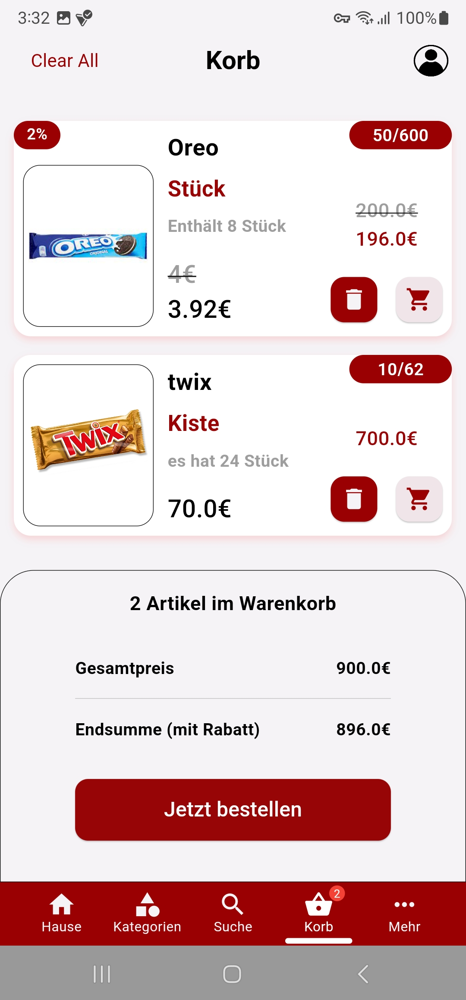

# 🔥👏 Zaza App

An e-commerce created with Flutter and Node Js 💻

## Getting Started

Zaza App is an e-commerce application specifically designed for grocery stores. The app aims to provide users with a seamless online grocery shopping experience. It incorporates various functionalities to handle user accounts, manage shopping baskets, and process orders efficiently.

Star ⭐ the repo to support the project.

## Features

- User Authentication and Account Management: Allows users to log in, reset their passwords, and manage their accounts.

- User Profile Management: Enables users to view and update their profile information, including adding or removing phone numbers.

- Product and Category Management: Provides users with the ability to browse product categories, search for products, and view detailed product information.

- Shopping Basket Management: Manages the user's shopping basket by allowing items to be added, removed, and quantities adjusted.

- Order Management: Processes user orders and allows users to view their order history and order details.

- Favorites Management: Lets users add items to their favorites list and view their favorite products.

- Discounts and Offers: Displays available discounts to the user.
## Screenshots

  
   
  

  
   
  

  
   
  

  
   
  

  
   
  

## Tools

- Front-end: Dart - Flutter framework
- Back-end: Php - NodeJs framework
- State Management: Bloc
- Data Networking: Dio package

## Questions?🤔

Hit me on

## Contributing

This project was done By:

[@Bassam-Jawish](https://github.com/Bassam-Jawish)
[@Qusai Armoush](https://github.com/Qusai963)

Pull requests are welcome.
